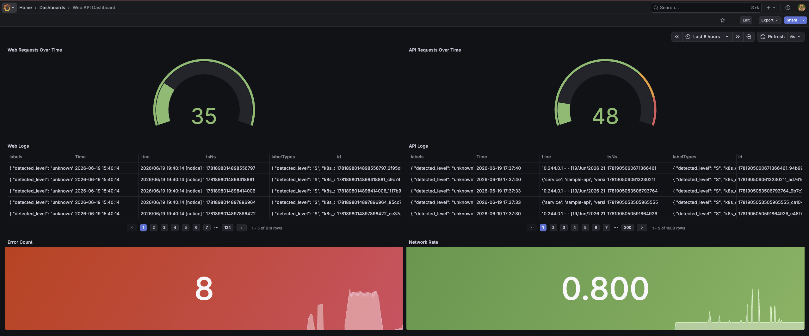

# Bootstrapping

## Deploy Github Kubernetes Secret manually

If you want to use a secrets manager or SOPS you can do that as well.
```bash
kubectl create secret generic controller-manager \
  -n runners \
  --from-literal=github_token=YOUR_GITHUB_PAT
```

## Flux Install

### Install the CLI
| Operating System | Package Manager         | Command                                             |
| ---------------- | ----------------------- | --------------------------------------------------- |
| macOS            | Homebrew                | `brew install fluxcd/tap/flux`                      |
| Linux            | Official Install Script | `curl -s https://fluxcd.io/install.sh \| sudo bash` |
| Windows          | Chocolatey              | `choco install flux`                                |
| Windows          | Winget                  | `winget install FluxCD.Flux`                        |
| Windows          | Scoop                   | `scoop install flux`                                |

Then deploy pods and CRDs
```bash
flux install

# verify install
kubectl get crds | grep toolkit
kubectl get pods -n flux-system
```

## Bootstrap Flux
```bash
export GITHUB_USER="YOUR_GITHUB_USER"
export GITHUB_REPO="infra-gitops"

flux check --pre

flux bootstrap github \
  --owner=$GITHUB_USER \
  --repository=$GITHUB_REPO \
  --branch=main \
  --path=clusters/docker-desktop \
  --personal
```
Paste your PAT when prompted.

## Flux Commands

Observe all your resources:
```bash
flux get all -A

# or continuously watch

flux get all -A --watch
```

Independent Resources:
```bash
flux get sources all

flux get kustomizations # shorthand ks

flux get helmreleases # shorthand hr
```

Reconcile commands:
```bash
flux reconcile kustomization arc-controller --with-source -n flux-system
flux reconcile kustomization arc-runners --with-source -n flux-system
```

## Sample Apps

Manually create Github Registry Cred Secrets for both Sample API and Sample Web
```bash
kubectl create secret docker-registry ghcr-pull-secret \
  --namespace sample-web \
  --docker-server=ghcr.io \
  --docker-username=YOUR_USERNAME \
  --docker-password=YOUR_PAT \
  --docker-email=YOUR_EMAIL

kubectl create secret docker-registry ghcr-pull-secret \
  --namespace sample-web \
  --docker-server=ghcr.io \
  --docker-username=YOUR_USERNAME \
  --docker-password=YOUR_PAT \
  --docker-email=YOUR_EMAIL
```

Manually create your secret for your runner
```bash
kubectl create secret generic github-runner-secret \
-n runners \
--from-literal=github_token=YOUR_PAT
```

## Sample Grafana Dashboard


## Port Forwarding for Services
Run each one in a separate terminal window
```bash
kubectl port-forward -n observability svc/grafana 3000:80
kubectl port-forward -n sample-api svc/sample-api 8080:8080
kubectl port-forward -n sample-web svc/sample-web 8081:80
```